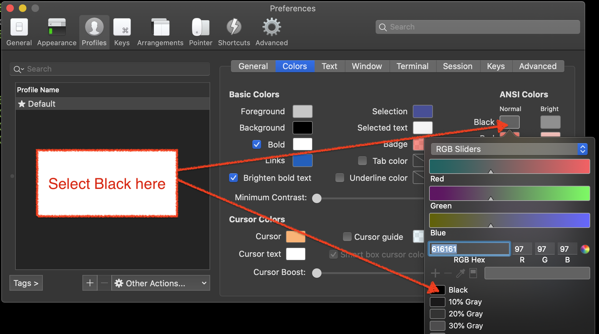

Troubleshooting
===============

Installation issues
-------------------

Android
^^^^^^^

To run on Android, you need access to a CLI environment.  I've found that https://termux.com does
the trick, but you need to install some extra packages before you can install asciimatics.

After installing termux, start up the app and run the following commands:

.. code-block:: bash

    apt update
    apt-get install clang python-dev libjpeg-turbo-dev
    LDFLAGS=-L/system/lib pip install Pillow
    pip install asciimatics

Linux
^^^^^
Although asciimatics is a pure python implementation, it depends on Pillow (a fork of the Python
Imaging Library).  This package depends on some native libraries that must be installed first.
For details of what libararies you need, see `the Pillow documentation
<http://pillow.readthedocs.io/en/latest/installation.html#external-libraries>`__.

For a list of possible solutions, see the `answer on Stackoverflow
<http://stackoverflow.com/q/24646305/4994021>`__.  In short, either install the native libraries
you need, or force an installation of an older version (2.9.0) of Pillow.

My application only runs on Windows
-----------------------------------
Given that your application runs on Windows, but not any curses-based solution (i.e. Mac or
Linux), the fundamental logic in your code is right.  It might be a bug in asciimatics, but it
could also be a bug in your system installation.

Curses-based systems date back to an era when people connected to a computer via dumb terminals.
Each terminal needed different control character sequences to tell it what to do.  These
differences are handled by curses, which picks the right definition based on your `TERM`
environment variable.  If you have the wrong terminal definition, you may find that curses
believes some fundamental services are unavailable to your application.  In particular, if
you use ``xterm-color``, you are using a definition of xterm that dates back to 1996 and will
see errors like this, where the critical point is thet a curses function returned an unexpected
error (the "ERR" result).

.. code-block:: bash

    Traceback (most recent call last):
        File "demo.py", line 18, in <module>
           Screen.wrapper(demo)
        File "./lib/python3.6/site-packages/asciimatics/screen.py", line 1162, in wrapper
           unicode_aware=unicode_aware)
        File "./lib/python3.6/site-packages/asciimatics/screen.py", line 1131, in open
            unicode_aware=unicode_aware)
        File "./lib/python3.6/site-packages/asciimatics/screen.py", line 2001, in __init__
            curses.curs_set(0)
    _curses.error: curs_set() returned ERR

The fix is to use a more modern terminal definition like ``xterm`` or ``xterm-256color``.

256 colours not working
-----------------------
By default a lot of terminals will only support 8/16 colours.  Windows users are limited to just
these options for a native Windows console.  However other systems can enable extra colours by
picking a terminal that supports the extended colour palettes.  For details of which terminals
support additional colours and how to enable them see `this Wikipedia article
<https://en.wikipedia.org/wiki/Comparison_of_terminal_emulators>`_.

In most cases, simply selecting a terminal type of ``xterm-256color`` will usually do the trick
these days.

My colours are wrong
--------------------
When picking colours you may find that your selection doesn't have the desired effect.  This is
because terminals have a nasty habit of using different definitions of the standard colours.

Asciimatics relies on the ANSI colour set for its standard settings.  As you can see
`here <https://en.wikipedia.org/wiki/ANSI_escape_code#Colors>`_ each terminal has its own
interpretation of the exact colour.  However, you can usually tweak that in your terminal
settings.  For example, iTerm on Mac uses a dark grey for black, which you can change as
shown below.

The color theme resets when I resize the terminal
-------------------------------------------------
There was a bug where asciimatics would not maintain its own colour themes on resize.  This
has been fixed as of early 2020.  You should just upgrade to the latest version to fix this.

However, there are also some other applications that change the terminal colour scheme on
startup using the terminal's control sequences.  These will not be invoked by asciimatics
on a resize event.  If you use such an application, you will need to invoke the control
sequences yourself.

For example, to re-apply a `pywal <https://github.com/dylanaraps/pywal>`_ color theme:

.. code-block:: python

    from pathlib import Path
    from asciimatics.screen import ManagedScreen

    with ManagedScreen() as screen:
        # do stuff
        if screen.has_resized():
            wal_sequences = Path.home() / ".cache" / "wal" / "sequences"
            try:
                with wal_sequences.open("rb") as fd:
                    contents = fd.read()
                    sys.stdout.buffer.write(contents)
            except Exception:
                pass

.. _mouse-issues-ref:

Mouse support not working
-------------------------
Curses systems
^^^^^^^^^^^^^^
Mouse support isn't fully enabled by default on all terminal types.  This will often require some
extra extensions to be enabled as described `here
<http://unix.stackexchange.com/questions/35021/how-to-configure-the-terminal
-so-that-a-mouse-click-will-move-the-cursor-to-the>`__.  In addition, if you want 256 colours, you
will need to mix modes as described `here
<http://stackoverflow.com/questions/29020638/which-term-to-use-to-have-both
-256-colors-and-mouse-move-events-in-python-curse>`__.

Although it is possible to get Linux terminals to report all mouse movement, the reporting of mouse
buttons along with movement appears to be highly erratic.  The best reporting appears to be using
the button event mode - i.e. mixing ``xterm-1002`` with ``xterm-256color``.

Windows
^^^^^^^
Asciimatics will reprogram the Windows console to report mouse events on start-up.  However, it is
possible to change this while the application is running.  In particular, if you switch on
QuickEdit mode, Windows will stop reporting mouse events and process them itself.  It is not
possible to have both, so if you want to use the mouse in your app, please switch off QuickEdit
mode.

Windows title does not change
-----------------------------
Much like mouse support, the commands to set the window title is not supported on all terminal
types.  Windows should work without any changes.  Other systems may need to use a similar method
as above to mix modes to add status line support as described `here
<https://gist.github.com/KevinGoodsell/744284>`_.

.. _ctrl-s-issues-ref:

Ctrl+S does not work
--------------------
In order to maintain legacy support for real terminal systems, most terminals/consoles still
support software flow control using Ctrl+S/Ctrl+Q. You can switch this off on Linux by typing
``stty -ixon`` in your shell before you start asciimatics as explained `here
<http://unix.stackexchange.com/questions/12107/
how-to-unfreeze-after-accidentally-pressing-ctrl-s-in-a-terminal>`__. Sadly, there is nothing that
can be done on Windows to prevent this as it is built in to the operating system, so you will never
be able to detect the Ctrl+S key.  See `here
<http://stackoverflow.com/questions/26436581/is-it-possible-to-disable-system-
console-xoff-xon-flow-control-processing-in-my>`__ for details.

Backspace or delete are not working
-----------------------------------
Some users have reported this on curses systems.  So far this has been tracked down to issues with
the terminal configuration.  For an in-depth explanation of the problem and several possible
solutions see `here <http://www.ibb.net/~anne/keyboard.html>`__ and
`here <http://invisible-island.net/xterm/xterm.faq.html#xterm_erase>`__.

This seems to be particularly problematic for Mac OS X users, where the default terminal app as
shipped with the OS doesn't match the terminfo definitions.  Genius!  If you're on OSX, running
the following inside your terminal *should* fix up the mismatch.

.. code-block:: bash

    infocmp "$TERM" | sed -Ee 's/(kbs)=[^,]*/\1=\\177/' -e 's/(kdch1)=[^,]*/\1=\\E[3~/' > "$TERM"
    tic "$TERM"
    rm -f "$TERM"

In an attempt to minimize the number of affected platforms, asciimatics v1.9.0 and later will also
check the OS terminal definitions for ERASE and use that for backspace if it differs from the curses
terminal definition.

There's a big delay when I press Escape
---------------------------------------
This is a well-known default operation for ncurses.  As documented `here 
<https://stackoverflow.com/a/28020568/4994021>`__ you need to set the `ESCDELAY` environment
variable before opening the Screen so that ncurses uses a shorter delay.

I can't run it inside PyCharm or other IDEs
-------------------------------------------
Depending on which version you're using, you may see pywintypes.error 6 (ERROR_INVALID_HANDLE), or
simply nothing (i.e. it looks like the program has hung).  The reason for this is that the IDE
Terminal/Console is not a true native terminal/console and so the native interfaces used by
asciimatics will not work.  There are 2 workarounds.

1. The simplest is just to run asciimatics inside a real terminal or window - i.e. not inside
   PyCharm/the IDE.

2. If you must run inside PyCharm, the Professional edition offers an option to emulate console
   output directly in PyCharm. To enable this functionality, see *Run | Edit Configurations | 
   Configuration | Execution | Emulate terminal in output console*, otherwise you must start a
   real console from the Terminal window e.g. using `start cmd /c "python <your file name>"`.

.. _unicode-issues-ref:

Unicode characters are not working
----------------------------------
Curses systems
^^^^^^^^^^^^^^
Most modern versions of Linux/OSX come with a good selection of glyphs supported as standard.  The
most likely issue is that you are not using a UTF-8 locale.

To set this up, follow the instructions `here <http://stackoverflow.com/q/7165108/4994021>`__ for
OSX or `here <http://serverfault.com/q/275403>`__ for Linux.

If that doesn't solve the problem and you are seeing unexpected lines in your block drawing
characters, you are using a Terminal with extra spacing between your lines.

OSX allows you to edit the spacing as explained `here <http://superuser.com/
questions/350821/how-can-i-change-the-line-height-in-terminal-osx>`__, but Linux users will
probably need to install a different terminal as explained `here
<http://askubuntu.com/questions/194264/how-do-i-change-the-line-spacing-in-terminal>`__.  I have
found that `rxvt-unicode-256color` is most likely to work.

Windows
^^^^^^^
On Windows systems, there are a couple of potential issues.  The first is that you might be using
the wrong code page.  Windows comes with `many <https://msdn.microsoft.com/en-us/library/windows/
desktop/dd317756(v=vs.85).asp>`__ code pages.  By default, asciimatics will only enable unicode
features if you are using code page 65001 (the UTF-8 code page).  You can fix this issue by
running::

    chcp 65001

If this does not solve the issue, the next possibility is that you may be using the Lucida Console
or Consolas fonts.  These do not have a full enough range of glyphs to support all the unicode
output that asciimatics can generate.

To fix this issue, you need to download a font with a wider range of glyphs and then install them
as the default for your command prompt.  Details of how to do that are available `here <http://
www.techrepublic.com/blog/windows-and-office/quick-tip-add-fonts-to-the-command-prompt/>`__.
I recommend that you use the `DejaVu Mono font <http://dejavu-fonts.org/wiki/Main_Page>`__, which
you can extract from the ZIP file from the `download page
<http://dejavu-fonts.org/wiki/Download>`__ - it is DejaVuSansMono.ttf in the TTF folder of the ZIP.

Redirecting STDIN
-----------------
Generally speaking, it is not recommended that you try to do this as it will prevent asciimatics
from being able to read the terminal input.  However, if you must do this, `this question
<http://stackoverflow.com/q/3999114/4994021>`__ on StackOverflow should give you some help on how
to reconnect terminal input on curses based systems.

It's just not working at all
----------------------------
Some people have reported truly strange issues where things simply don't start up at all.
Symptoms vary wildly from blank screens to other applications or tests running instead.

If you are hitting something like this, check that you haven't created a file called ``test.py``
in your project.  This is because the ``future`` package, which asciimatics uses for
compatibility with Python 2 and 3, imports the test package.  If you happen to have a file called
``test.py`` in your project, this import could pick up your file instead of the built-in package.

Shout out to Andrew Penniman for spotting and solving this one!

It's too slow!
--------------
When people say this, they either mean that asciimatics is using too much CPU, or that it is
unresponsive in some scenario.  Either way, the solution is to reduce the work being done
behind the scenes for your application.  At a high-level you have 3 options.

1. Switch off any animations you don't need.
2. Move to a more responsive input loop.
3. Use a faster implementation of the underlying infrastructure.

Lets look at these options in more detail...

Switch off animations
^^^^^^^^^^^^^^^^^^^^^
The key to this optimization is to understand what you're drawing when.  The biggest cost in
the mainline loop is the actual re-drawing of all the content to the double-buffers, so asciimatics
only does this when it knows something has, or may have, changed.  You give hints to asciimatics as
you construct your application - for example the rate at which a ``Print`` Effect needs to redraw,
or whether you want to minimize CPU usage inside a ``Frame``.  It then uses these hints and the
current application state to decide whether to draw a new frame into the double-buffer.

The first thing to look at is things that are not actually changing.  For example if you use the
``Print`` Effect to display a static piece of text (like a ``FigletText`` renderer), the output
never changes and so you only need to draw it once.  in such cases, you should tell the Effect
that it is pointless to refresh by specifying ``speed=0`` on construction.

Next you should consider removing unnecessary Effects.  This is only really an option for TUI
systems.  Simply avoid adding other ``Effects`` into your ``Scene`` and keep it down the to the
``Frame`` for your user input.

Finally, consider switching off the cursor animation if you really need to minimize CPU usage.
You can do this by setting ``reduce_cpu=True`` when constructing your ``Frame``.

Input responsiveness
^^^^^^^^^^^^^^^^^^^^
First things first, you should make sure that you're running at least version 1.11.  Once you
have that installed, you can use the ``allow_int`` option in :py:meth:`.play` to permit mouse
and keyboard input to interrupt the normal frame refresh rate.

This should prevent users from seeing any delay in refreshes when they press a key.  However
there is a downside to this option - it will slightly mess up the timings for any animations,
so it is only recommended to use it in TUI applications.

Use faster infrastructure
^^^^^^^^^^^^^^^^^^^^^^^^^
Asciimatics needs to do a lot of array manipulation in order to provide equivalent features to
ncurses.  In v1.11, I benchmarked various options and optimized the buffering to use the fastest
version.  If you haven't already moved to that version (or later), please do that now.

From here you have the usual options to speed up such calculations further.

1. Use ``numpy`` - which is a native C package to optimize array calculations
2. Use ``pypy`` - which is an optimized version of the Python language.

Right now, asciimatics doesn't support ``numpy``, because I only got marginal gains when I
made the prototype for 1.11.  However, I got significant improvements from ``pypy`` and so I'd
definitely recommend considering this option.

For example, running some samples for 20s on my test machine, I got the following results:

==================== ===========
julia.py             Average CPU
==================== ===========
Python 2.7 (1.10)    54.8%
Python 2.7 (1.11)    47.8%
Pypy 6.0             20.0%
==================== ===========

==================== ===========
experimental.py      Average CPU
==================== ===========
Python 2.7 (1.10)    100.0%
Python 2.7 (1.11)    71.4%
Pypy 6.0             34.3%
==================== ===========

Note that the v1.10 test for experimental.py was actually CPU-bound and so slow it was visibly
juddering.
